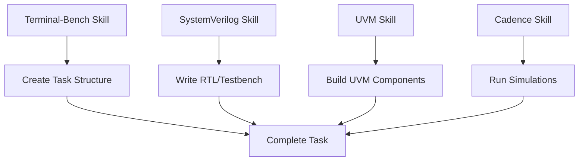

# Hardware Verification Skills Suite

## Overview

I've created a comprehensive suite of **four specialized skills** for hardware verification and Terminal-Bench task creation. Each skill has a focused responsibility and can be used independently or together for complete verification workflows.

## Skills Created

### 1. 📊 Terminal-Bench Skill
**File**: `terminal-bench.skill`  
**Purpose**: Master the Terminal-Bench framework for creating AI agent benchmark tasks

**Coverage**:
- Task structure and components
- Docker environment setup
- YAML configuration
- Solution development (shell scripts and YAML)
- Test verification with Python
- `tb` CLI commands and options
- Task validation and debugging
- Best practices for task creation

**Use Cases**:
- Creating new Terminal-Bench tasks
- Running benchmarks on AI agents
- Validating task completeness
- Debugging failing tasks

---

### 2. 🔧 UVM Skill
**File**: `uvm.skill`  
**Purpose**: Comprehensive Universal Verification Methodology knowledge

**Coverage**:
- All UVM components (Driver, Monitor, Sequencer, Agent, Environment, Test)
- UVM phases and objections
- TLM communication
- Configuration database
- Factory pattern and overrides
- Sequences and virtual sequences
- Register Abstraction Layer (RAL)
- Coverage collection
- Best practices and common pitfalls

**Use Cases**:
- Building reusable testbenches
- Creating verification components
- Debugging UVM issues
- Coverage-driven verification

---

### 3. 💻 SystemVerilog Skill
**File**: `systemverilog.skill`  
**Purpose**: Complete SystemVerilog language reference

**Coverage**:
- Data types (2-state, 4-state, arrays, structures)
- Object-oriented programming
- Interfaces and modports
- Processes and synchronization
- Constraints and randomization
- Assertions (immediate and concurrent)
- Coverage (functional and code)
- File I/O and system tasks
- DPI (Direct Programming Interface)
- Packages and compilation units

**Use Cases**:
- RTL design
- Verification code development
- Assertion-based verification
- Constraint random testing

---

### 4. 🛠️ Cadence Tools Skill
**File**: `cadence.skill`  
**Purpose**: Cadence EDA tools expertise

**Coverage**:
- Xcelium Simulator (xrun, xmvlog, xmelab, xmsim)
- SimVision GUI and waveform debugging
- Incisive Metrics Center (IMC) for coverage
- JasperGold formal verification
- Genus synthesis
- Innovus place and route
- VManager regression management
- Indago advanced debug
- Environment setup and configuration

**Use Cases**:
- Running simulations
- Coverage analysis and closure
- Formal property verification
- Synthesis and implementation
- Debug complex verification issues

## How These Skills Work Together

### For Terminal-Bench UVM Task Creation



**Workflow Example**:
1. Use **Terminal-Bench** skill to scaffold task structure
2. Apply **SystemVerilog** knowledge to write DUT and interfaces
3. Use **UVM** skill to create testbench components
4. Apply **Cadence** tool knowledge to compile and simulate
5. Use **Terminal-Bench** to validate task completion

### Skill Synergies

| Combined Skills | Enables |
|----------------|---------|
| Terminal-Bench + UVM | Creating verification benchmark tasks |
| SystemVerilog + UVM | Writing complete testbenches |
| SystemVerilog + Cadence | RTL simulation and debug |
| UVM + Cadence | Coverage-driven verification |
| All Four | Complete verification environment tasks |

## Installation

Each skill is packaged as a `.skill` file (ZIP archive). To use:

### Option 1: Direct Import
Load the `.skill` files directly into Claude or your development environment

### Option 2: Extract and Explore
```bash
# Extract any skill
unzip terminal-bench.skill
unzip uvm.skill
unzip systemverilog.skill
unzip cadence.skill

# View skill content
cat terminal-bench/SKILL.md
```

## Usage Examples

### Creating a Terminal-Bench UVM Task

```bash
# 1. Use Terminal-Bench skill to understand structure
tb tasks create --wizard

# 2. Use SystemVerilog skill to write RTL
# Create DUT with proper SV syntax

# 3. Use UVM skill to build testbench
# Create agents, drivers, monitors

# 4. Use Cadence skill to set up simulation
xrun -sv -uvm design.sv testbench.sv
```

### Debugging a Failing Testbench

```bash
# 1. Use Cadence skill for simulation debug
xrun -gui -access +rwc

# 2. Use UVM skill to understand phase issues
+UVM_PHASE_TRACE

# 3. Use SystemVerilog skill for language issues
# Check blocking vs non-blocking, races

# 4. Use Terminal-Bench skill to fix task
tb tasks check -t my-task
```

## Skill Characteristics

### Modularity
Each skill is self-contained and focused on one domain. This makes them:
- Easy to maintain
- Simple to understand
- Reusable across projects
- Composable for complex tasks

### Comprehensive Coverage
Together, these skills cover:
- Framework knowledge (Terminal-Bench)
- Methodology (UVM)
- Language (SystemVerilog)  
- Tools (Cadence)

### Based on Standards
- Terminal-Bench: Official documentation
- UVM: IEEE 1800.2-2020
- SystemVerilog: IEEE 1800-2017
- Cadence: Official tool documentation

## Quick Reference

### File Sizes
- `terminal-bench.skill`: Complete TB framework guide
- `uvm.skill`: Full UVM methodology reference
- `systemverilog.skill`: SV language specification
- `cadence.skill`: Cadence tools documentation

### When to Use Which Skill

| Task | Primary Skill | Supporting Skills |
|------|--------------|-------------------|
| Create TB task | Terminal-Bench | All others |
| Write testbench | UVM | SystemVerilog |
| Debug simulation | Cadence | UVM, SystemVerilog |
| Fix compilation | SystemVerilog | Cadence |
| Analyze coverage | Cadence | UVM |
| Create sequences | UVM | SystemVerilog |
| Set up Docker | Terminal-Bench | - |
| Write assertions | SystemVerilog | Cadence |

## Best Practices

1. **Load skills as needed** - Don't load all four unless necessary
2. **Start with Terminal-Bench** for task structure
3. **Use UVM + SystemVerilog** together for testbench development
4. **Apply Cadence** knowledge for tool-specific issues
5. **Combine skills** for complex verification tasks

## Advanced Usage

### Creating Custom Workflows

Combine skill knowledge to create specialized workflows:

```python
# Example: Automated UVM task generation
# Uses all four skills

def create_uvm_verification_task(dut_name, protocol):
    # Terminal-Bench: Create structure
    create_task_structure(dut_name)
    
    # SystemVerilog: Generate interfaces
    generate_sv_interface(protocol)
    
    # UVM: Build testbench
    generate_uvm_agent(protocol)
    generate_uvm_test()
    
    # Cadence: Create run scripts
    generate_xrun_makefile()
    
    # Terminal-Bench: Add tests
    create_test_verification()
```

### Skill Composition Pattern

```
Base Knowledge: SystemVerilog
  ↓
Methodology Layer: UVM  
  ↓
Tool Layer: Cadence
  ↓
Framework Layer: Terminal-Bench
```

## Troubleshooting

| Problem | Relevant Skill |
|---------|---------------|
| Task structure unclear | Terminal-Bench |
| UVM phases not running | UVM |
| Syntax errors | SystemVerilog |
| Simulation won't start | Cadence |
| Coverage not collected | Cadence + UVM |
| Docker build fails | Terminal-Bench |
| Assertions not firing | SystemVerilog |
| Virtual interface not set | UVM |

## Future Enhancements

These skills can be extended with:
- Additional EDA tools (Synopsys VCS, Mentor Questa)
- More protocols (AXI, PCIe, USB)
- Formal verification methodologies
- Low-power verification (UPF)
- SystemC integration
- Emulation platforms

## Support

For questions about:
- **Terminal-Bench**: See https://www.tbench.ai/docs
- **UVM**: Refer to IEEE 1800.2-2020 standard
- **SystemVerilog**: Check IEEE 1800-2017 standard
- **Cadence**: Visit support.cadence.com

## Summary

This skills suite provides everything needed for:
1. Creating Terminal-Bench verification tasks
2. Building UVM testbenches
3. Writing SystemVerilog code
4. Using Cadence EDA tools

Each skill is:
- **Focused**: Single responsibility
- **Comprehensive**: Complete coverage of its domain
- **Practical**: Includes examples and best practices
- **Composable**: Works well with other skills

Use them individually or together to tackle any hardware verification challenge!
